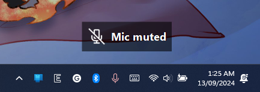
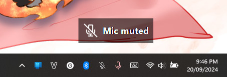

# Microphone Mute Indicator

I often forgot to press "Unmute" button on calls or meetings due to there're no visual indicator on my laptop. This is the indicator for "Muted" state, only shown when there's an app using the microphone.

Added new `TrayIcon` (`v1.2` or later)!
- Right-click to toggle OSD
- Left-click to toggle `Muted` state.

Toast notification design from [G-Helper](https://github.com/seerge/g-helper).
